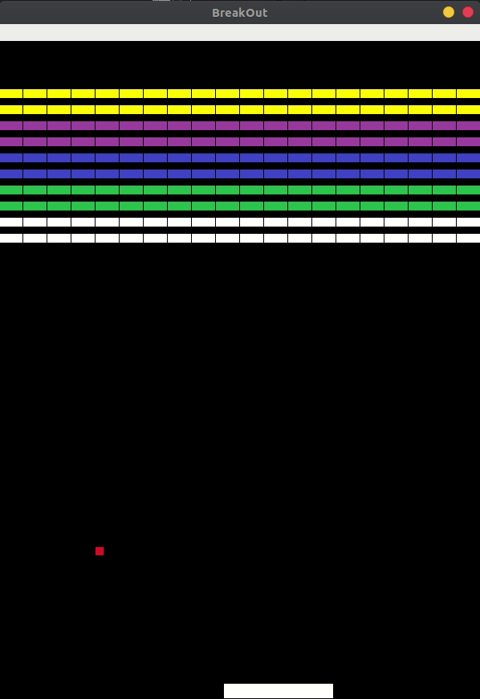

# BreakOut Clone
A java based game of the popular early 1980s atari game [BreakOut](https://en.wikipedia.org/wiki/Breakout_(video_game)) developed for CS 03 - Introduction to Java class.

## Get Started

The game is divided between 7 java files being the following:

 - **Gaem.java:** 
    - Main file in which the window is initializes the board.
 - **Ball.java:**
    - File that contains all the logic for the ball. 
 - **Board.java:**
    - Contains all the logic of the game board. It sets up all the bricks for the game as well as the ball and paddle. 
     - Handles the painting of objects of the game as well
 - **Brick.java:**
    - Contains the logic of each brick
 - **Paddle.java:**
    - Contains the logic of the paddle
 - **Sprite.java:**
    - Each object gets inherited from this to handle positioning
 - **Title.java:**
    - Was going to be the title.

## Known Bugs

These are the known bugs that I have seen appear in the game.

1. Executing the .jar file will output errors stating that it can not find the image files to load the game. 
2. Executing the project in either Netbeans or Eclipse will delete the images folder under "./build/classes/images". A backup folder with the images is located at "./src/images"
3. While executing the game there is a *small* possibility that the ball will go out of bounds (pass the left or right walls). After a while it will display "Game Over"
4. Menu bar might appear invisible until you click on it.
5. Ball might not bounce in the direction you anticipated (specifically the paddle).

## Release History

* 1.0.0 - December 2015
    * Completed the board, tiles, paddle, and ball. 

## Built With

* [Netbeans](https://netbeans.org/downloads/) - used for development of game
## Contributing

1. Not accepting anyone at the moment

## Authors
* **Roberto Sanchez** - *Initial work* - [Zyxel-1](https://github.com/Zyxel-1)

## License

This project is licensed under the MIT License - see the [LICENSE.md](LICENSE.md) file for details
